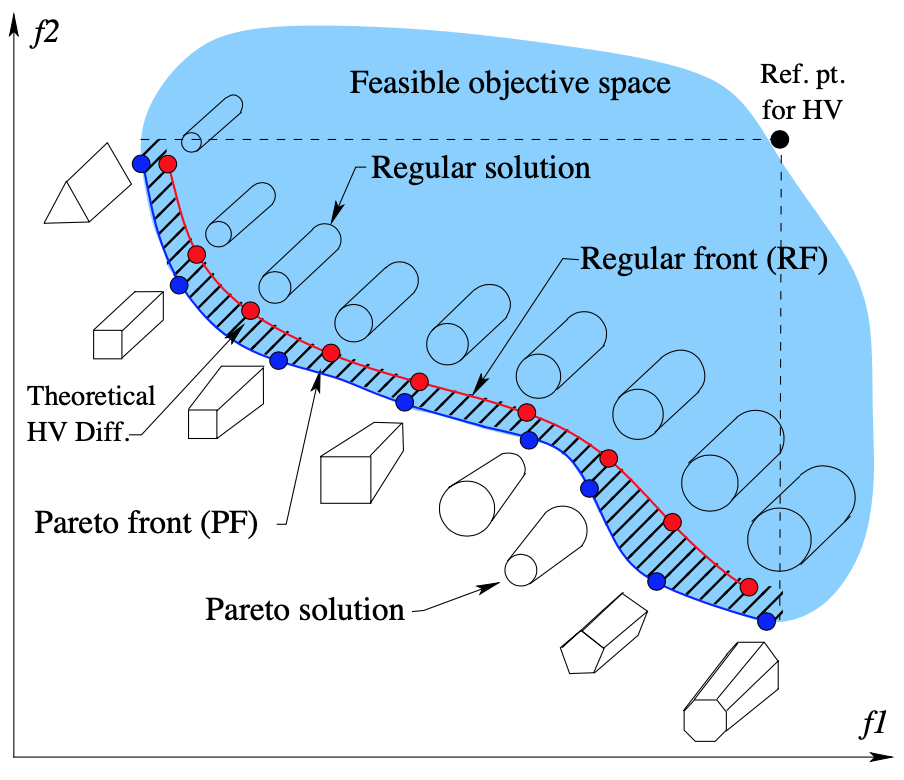
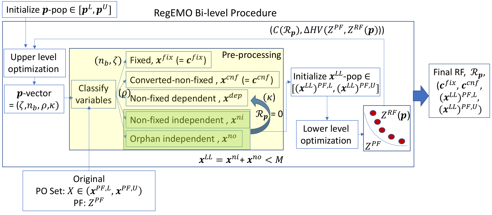
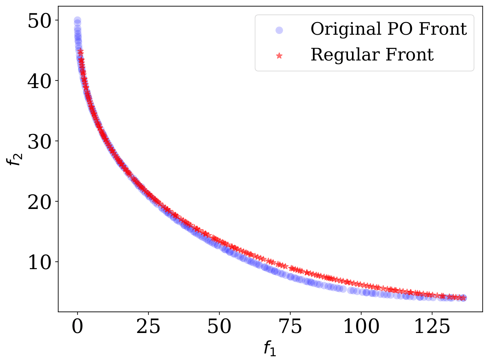
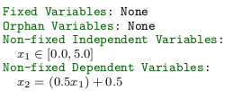

# RegEMO: Regularized Evolutionary Multi-objective Optimization

## Introduction
Multi-objective optimization problems give rise to a set of Pareto-optimal solutions, each of which makes a trade-off among the objectives. When multiple Pareto-optimal solutions are to be implemented for different applications as platform-based solutions, a solution principle common to them is highly desired for easier understanding, implementation, and management purposes. RegEMO is a systematic search methodology that deviates from finding Pareto-optimal solutions but finds a set of near Pareto-optimal solutions sharing common principles of a desired structure and still having a trade-off of objectives in them. RegEMO has been demonstrated over a number of constrained and unconstrained multi-objective test problems. Thereafter, we demonstrate the practical significance of the proposed approach to a number of engineering design problems. Searching for a set of solutions with common principles of desire, rather than Pareto-optimal solutions without any common structure, is a practically meaningful task and this paper should encourage more such developments in the near future.

The idea of regularity-based solution is shown in the following image. The blue points represent the original Pareto front solutions which do not have any interpretable regularity/common principles in them (represented by completely different shapes of the product). The red points, on the other hand, represent regular solutions which are all having the same shape (cylindrical) but different diameters. Here the regulariy is defined on the shape of the products, but it might vary depending on the application area. But, the regular set of solutions are easier to implement, highly scalable and interpretable.

  

The Bi-level procedure used in RegEMO to find the optimal regularity principle is shown using a diagram below:

  

## Please cite the following papers if you are using RegEMO:
    @ARTICLE{10328823,
      author={Guha, Ritam and Deb, Kalyanmoy},
      journal={IEEE Transactions on Evolutionary Computation}, 
      title={Compromising Pareto-Optimality With Regularity in Platform-Based Multi-Objective Optimization}, 
      year={2023},
      volume={},
      number={},
      pages={1-1},
      doi={10.1109/TEVC.2023.3336715}}

    @inproceedings{guha2023regemo,
      title={RegEMO: Sacrificing Pareto-Optimality for Regularity in Multi-objective Problem-Solving},
      author={Guha, Ritam and Deb, Kalyanmoy},
      booktitle={International Conference on Evolutionary Multi-Criterion Optimization},
      pages={29--42},
      year={2023},
      organization={Springer}
    }

## Problems
The problems used for the work are defined in the [problems](https://github.com/Ritam-Guha/regemo/tree/tevc/regemo/problems) directory. Any problem definition can be loaded using the [get_problem](https://github.com/Ritam-Guha/regemo/blob/tevc/regemo/problems/get_problem.py) function. 
We have used [pymoo](https://github.com/anyoptimization/pymoo) and [reproblems](https://github.com/ryojitanabe/reproblems) implementations to define the problems in Python.
Till now, we have the following problem definitions in the system:
* [BNH](https://github.com/Ritam-Guha/regemo/blob/tevc/regemo/problems/bnh.py)
* [C2DTLZ2](https://github.com/Ritam-Guha/regemo/blob/tevc/regemo/problems/c2dtlz2.py)
* [Car Cab Design](https://github.com/Ritam-Guha/regemo/blob/tevc/regemo/problems/car_cab_design.py)
* [Coil Compression Spring Design](https://github.com/Ritam-Guha/regemo/blob/tevc/regemo/problems/coil_compression_spring_design.py)
* [Conceptual Marine Design](https://github.com/Ritam-Guha/regemo/blob/tevc/regemo/problems/conceptual_marine_desgin.py)
* [Crashworthiness](https://github.com/Ritam-Guha/regemo/blob/tevc/regemo/problems/crashworthiness.py)
* [Disk Brake Design](https://github.com/Ritam-Guha/regemo/blob/tevc/regemo/problems/disk_brake_design.py)
* [DTLZ2](https://github.com/Ritam-Guha/regemo/blob/tevc/regemo/problems/dtlz2.py)
* [DTLZ5](https://github.com/Ritam-Guha/regemo/blob/tevc/regemo/problems/dtlz5.py)
* [DTLZ7](https://github.com/Ritam-Guha/regemo/blob/tevc/regemo/problems/dtlz7.py)
* [Four Bar Truss Design](https://github.com/Ritam-Guha/regemo/blob/tevc/regemo/problems/four_bar_truss_design.py)
* [GAA](https://github.com/Ritam-Guha/regemo/blob/tevc/regemo/problems/gaa.py)
* [Gear Train Design](https://github.com/Ritam-Guha/regemo/blob/tevc/regemo/problems/gear_train_design.py)
* [Hatch Cover Design](https://github.com/Ritam-Guha/regemo/blob/tevc/regemo/problems/hatch_cover_design.py)
* [Modified ZDT](https://github.com/Ritam-Guha/regemo/blob/tevc/regemo/problems/mod_zdt.py)
* [OSY](https://github.com/Ritam-Guha/regemo/blob/tevc/regemo/problems/osy.py)
* [Pressure Vessel Design](https://github.com/Ritam-Guha/regemo/blob/tevc/regemo/problems/pressure_vessel_design.py)
* [Reinforced Concrete Beam Design](https://github.com/Ritam-Guha/regemo/blob/tevc/regemo/problems/reinforced_concrete_beam_design.py)
* [Rocket Injector Design](https://github.com/Ritam-Guha/regemo/blob/tevc/regemo/problems/rocket_injector_design.py)
* [Scalable Truss Design](https://github.com/Ritam-Guha/regemo/blob/tevc/regemo/problems/scalable_truss.py)
* [Speed Reducer Design](https://github.com/Ritam-Guha/regemo/blob/tevc/regemo/problems/speed_reducer_design.py)
* [SRN](https://github.com/Ritam-Guha/regemo/blob/tevc/regemo/problems/srn.py)
* [TNK](https://github.com/Ritam-Guha/regemo/blob/tevc/regemo/problems/tnk.py)
* [Two Member Truss](https://github.com/Ritam-Guha/regemo/blob/tevc/regemo/problems/two_member_truss.py)
* [Water](https://github.com/Ritam-Guha/regemo/blob/tevc/regemo/problems/water.py)
* [Welded Beam Design](https://github.com/Ritam-Guha/regemo/blob/tevc/regemo/problems/welded_beam_design.py)
* [Modified ZDT 2D](https://github.com/Ritam-Guha/regemo/blob/tevc/regemo/problems/zdt_mod_2d.py)
* [Modified ZDT 3D](https://github.com/Ritam-Guha/regemo/blob/tevc/regemo/problems/zdt_mod_3d.py)

## Installation
Clone the repository:

    git clone --single-branch --branch tevc https://github.com/Ritam-Guha/regemo.git

If you want to create a new conda environment, use the following command:
    
    conda create -n regemo python=3.10
    conda activate regemo

Then install the necessary libraries:

    pip install -r requirements.txt

To check the working, run:
    
    cd regemo 
    sh example_run.sh

This script will run the code on <code>BNH</code> problem and store the results in <code>results/bnh</code> folder.

## Running the code
In order to run the regularity code on any selected problem, there are two ways to do that. If you want to perform an upper-level search, do the following:
    
    python3 -m regemo.algorithm.regularity_driver --problem_name bnh

You can change the parametric space for the upper level search by changing the values of the hyperparameters in [regularity_driver.py](https://github.com/Ritam-Guha/regemo/blob/tevc/regemo/algorithm/regularity_driver.py) in <code>exec_args</code> dictionary.
The results for each hyperparameter configuration will be stored in <code>results/hierarchical_search/bnh</code>.

If you want to run regularity on a problem with default hyperparameter configuration, you can run the following code:

    python3 -m regemo.algorithm.regularity_search --problem_name bnh

The result for this run will be stored at <code>results/bnh</code> folder.

## Result Interpretation
For BNH, we have seen the following regularity deviation (the Objective fronts in left, the regularity principle in right):

  
  

## Future Work
There are some limitations present in this setting which we plan on addressing in future updates:
* The framework does not allow non-linearity in the rules. (Non-linear RegEMO - Coming Soon)
* The framework also does not scale properly for more than 30 variables. (Scalable RegEMO - Coming Soon)
